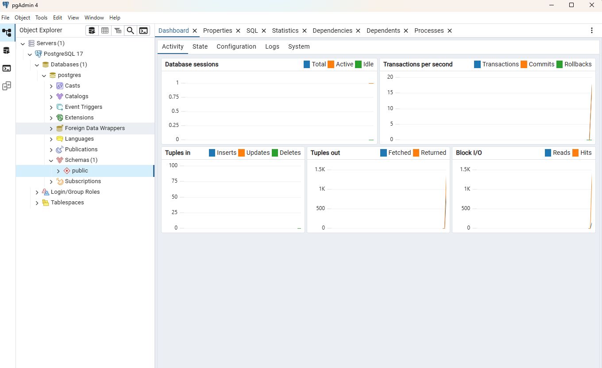
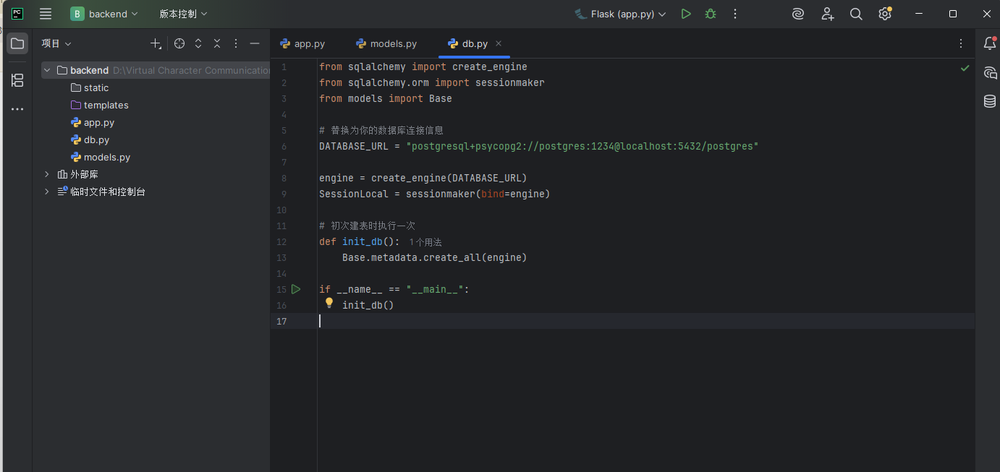
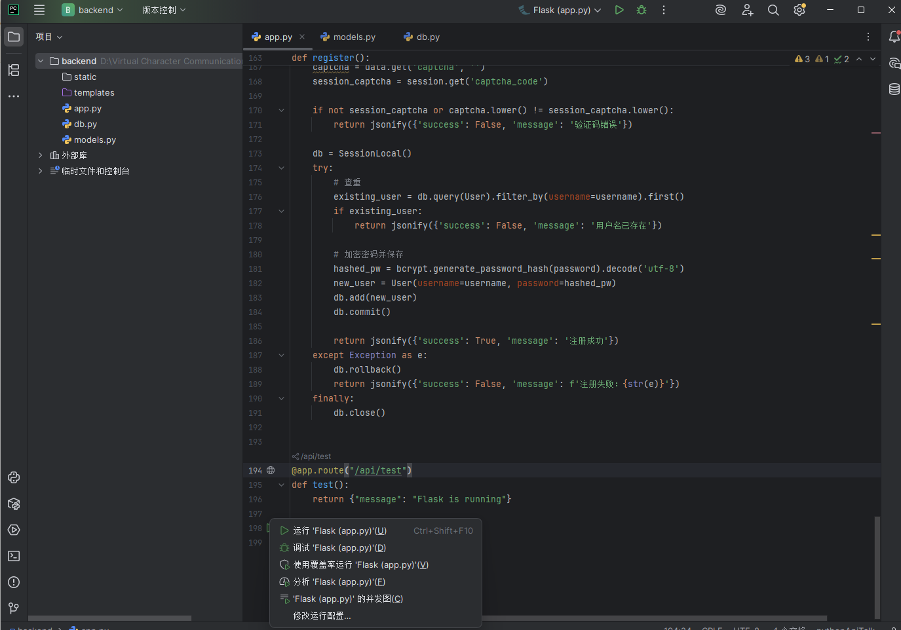

# ANiTalk - 虚拟角色交流平台

一个使用 Vite + Vue 3 + TypeScript + TailwindCSS 构建的二次元角色聊天工具。


## 功能特性

- 🎨 现代化的UI设计，使用TailwindCSS
- 🌈 渐变背景和半透明效果
- 📱 响应式设计，支持移动端
- ⚡ 基于Vite的快速开发体验
- 🎯 TypeScript支持，类型安全

## 页面结构

- **导航栏**: 包含首页和下载（可下载pc和安卓应用）按钮，以及登录注册按钮。
- **主页面**: 网页版体验可体验有限的功能，pc和安卓应用具备完整功能。了解更多可转到git文档页面。

## 开发指南
### 前端
#### 安装依赖

```bash
npm install
```

#### 启动开发服务器

```bash
npm run dev
```

访问 http://localhost:5173 查看效果

### 后端
#### 启动数据库
数据库使用PostgreSQL，先在pg Admin中启动本地数据库


#### 初始化表
运行python项目中的db.py


#### 启动后端服务
运行python项目中的app.py

## 开发计划
### 网页端
后端使用Flask + python实现。
### pc端
使用Tauri + Vite + Vue 3构建PC桌面应用，复用网页端代码。
pc端增加二次元人物桌面插件。
### 安卓app
使用Android Studio构建安卓APP。安卓应用增加桌面小组件，可显示二次元人物和通过小组件进行对话。